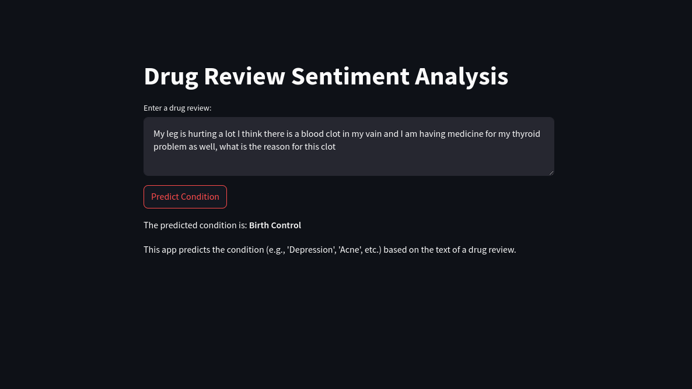
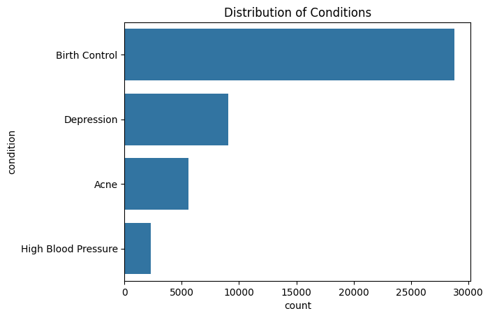
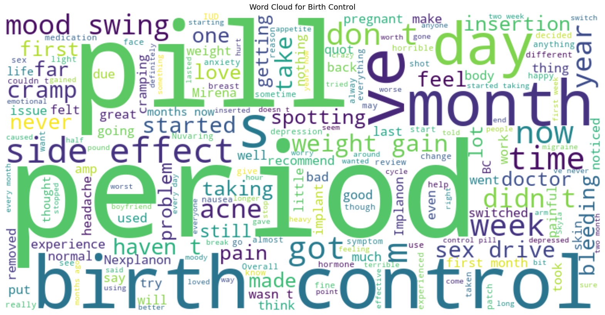

# Patient Condition Prediction

## Overview

This repository contains a machine learning project focused on predicting patient conditions based on textual prompts. The model classifies inputs into categories such as depression, birth control, and acne.



---

## Features
- Utilizes advanced NLP techniques to analyze patient-provided text inputs.
- Classifies conditions into categories like depression, birth control, and acne.
- Comprehensive Exploratory Data Analysis (EDA) performed to ensure high-quality insights.
- Built using state-of-the-art NLP tools and techniques.


### Exploratory Data Analysis (EDA)  

- **Conditions Count Analysis**: A visualization showcasing the distribution of different patient conditions, helping identify the most and least common categories.  


- **Birth Control EDA**: A focused analysis on birth control-related cases, providing insights into trends and patterns within this category.  


These analyses help in understanding the dataset structure and guiding model development. 

---

### Installation

1. Clone the repository:
   ```bash
   git clone https://github.com/Prtm2110/Patient-Condition-Predictor.git
   ```
2. Navigate to the project directory:
   ```bash
   cd Patient-Condition-Predictor
   ```
3. Install required dependencies:
   ```bash
   pip install -r requirements.txt
   ```
4. Run the Streamlit application:
   ```bash
   streamlit run app.py
   ```

---

## Technologies Used
- Natural Language Processing (NLP)
- Deep Learning (Keras, TensorFlow)
- Exploratory Data Analysis (EDA)
- Streamlit (for web app deployment)
- Python (NumPy, Pandas, Scikit-learn, Matplotlib, Seaborn)

---

## Contact
For any inquiries, feel free to reach out via GitHub Issues or email.

Happy Coding! 🚀
